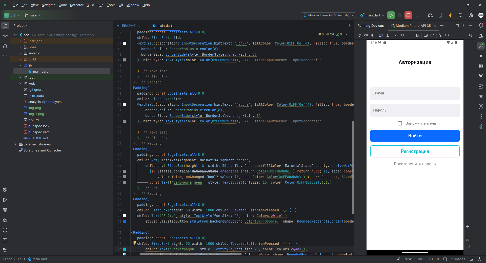

# Программирование корпоративных систем
Дисциплина: **Программирование корпоративных систем**  
Семестр: 5  
Выполнил студент **ЭФБО-03-22 Ковальчук В.С.**  

# Содержание работы
Описание работы  

