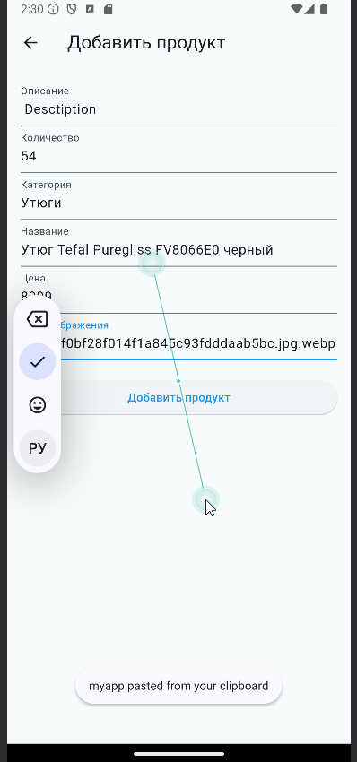

# Программирование корпоративных систем
Дисциплина: **Программирование корпоративных систем**  
Семестр: 5  
Выполнил студент **ЭФБО-03-22 Ковальчук В.С.**  

# Содержание работы
<<<<<<< HEAD
Описание работы  

Описание работы  

Описание работы  

=======
Добавил кнопку добавления товаров, при нажатии на кнопку пользователь попадает на страницу добавления товара
* 
* 
>>>>>>> 3d1a172 (pr4)
